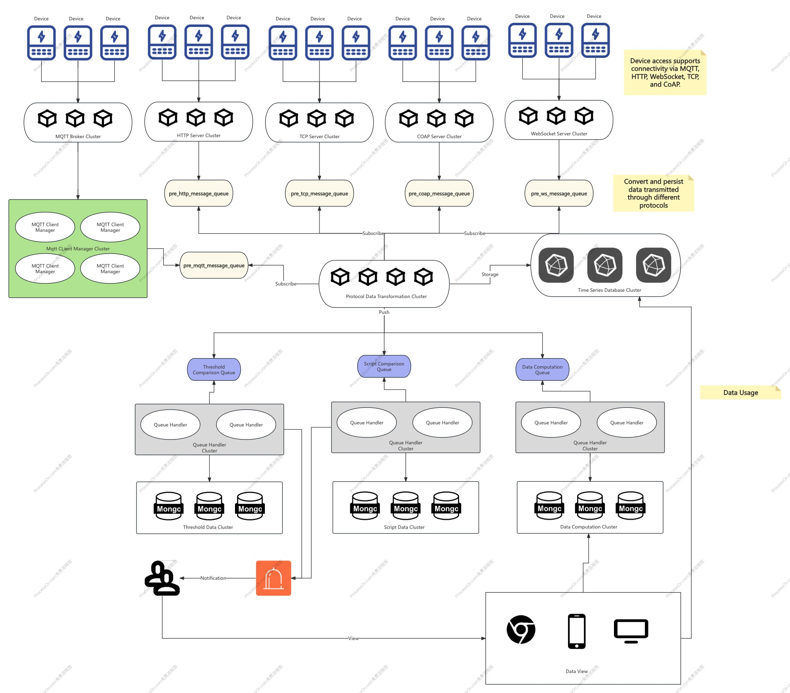

# Rust IoT Platform

这是一个基于 Rust 构建的高性能 IoT 开发平台，旨在支持多种协议并提供实时数据处理能力。该平台支持 MQTT、WebSocket (WS)、TCP 和 CoAP 协议，使其在各种物联网应用场景中具有极高的灵活性。

## 项目特点

- **高性能**：采用 Rust 编写，充分利用 Rust 的内存安全和并发特性，提供高效的 IoT 解决方案。
- **多协议支持**：支持 MQTT、WebSocket (WS)、TCP 和 CoAP 协议，适应不同的应用需求。
- **实时数据处理**：内建实时数据处理机制，保证数据的快速响应和高效传输。
- **模块化设计**：通过清晰的模块划分，便于扩展和维护。

功能清单 : [Feature](./feature_CN.md)

## 架构图

以下是该平台的架构图，展示了各个模块如何协同工作：

## 文件夹说明

- **[common](common)**：包含平台通用功能模块，如日志、配置管理等。
- **[data_processing](data_processing)**：用于数据处理的模块，包括数据解析、转换等操作。
- **[iot_protocol](iot_protocol)**：处理不同物联网协议的对接模块，包括 MQTT、WS、TCP 和 CoAP 协议。
- **[notification](notification)**：用于消息通知的模块，支持向设备或用户推送通知。
- **[api](api)**：提供对外 API 的模块，供外部系统与平台进行集成。

## 协议支持

- **MQTT**：支持标准的 MQTT 协议，适合实时消息传递应用。
- **WebSocket (WS)**：为 Web 客户端提供实时双向通信支持。
- **TCP**：通用的传输协议，适用于设备间的数据交换。
- **CoAP**：为低功耗设备设计的协议，适合嵌入式应用。

## 贡献

欢迎提交 PR 来改进项目，任何建议或问题请在 [Issues](https://github.com/iot-ecology/rust-iot-platform/issues) 中提出。

## License

[Apache 2.0 License](LICENSE) 

